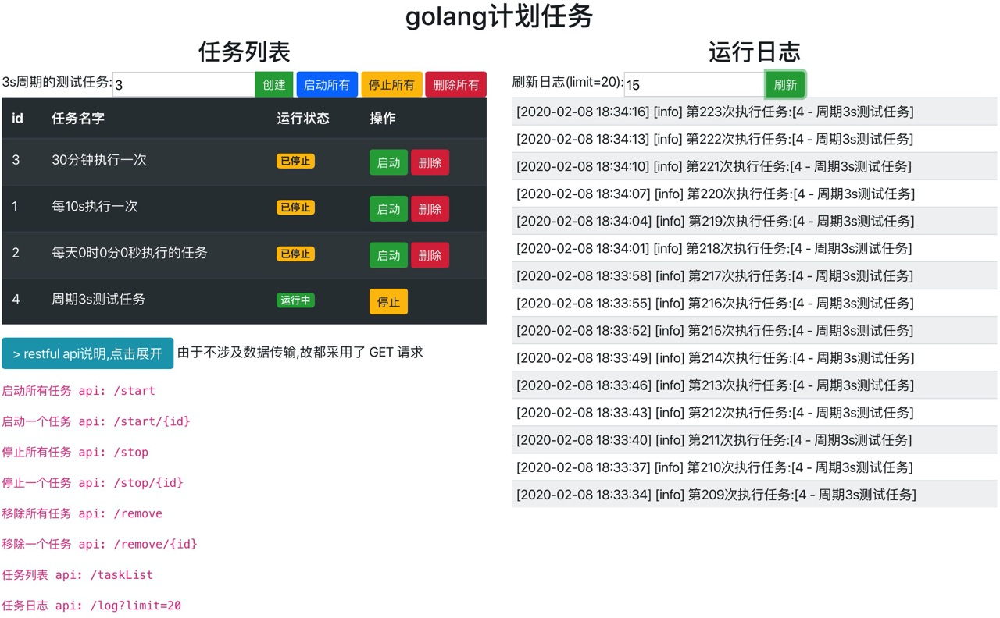

# crontab
a simple and powerful crontab written in golang with web page management  
golang实现的简单便捷的计划任务管理系统, 自带 web 界面,方便的管理多个任务  
支持 秒,分,时,日,月,周  

## 管理界面


## install
- go.mod
```shell script
require github.com/gohouse/crontab master
````

## web管理简单用例
```go
package main

import (
	"encoding/json"
	"fmt"
	"github.com/gohouse/crontab"
	"github.com/gohouse/crontab/client"
	"github.com/sirupsen/logrus"
	"log"
	"os"
	"time"
)

type logFormater struct {}
func (logFormater) Format(entry *logrus.Entry) ([]byte, error) {
	var marshal []byte
	if len(entry.Data) > 0 {
		marshal, _ = json.Marshal(entry.Data)
	}
	res := fmt.Sprintf("[%s] %s %s %s\n", entry.Level.String(), entry.Time.Format(time.RFC3339), entry.Message, marshal)
	return []byte(res),nil
}
func main() {
	var port = ":8200"
	// 日志
	logger := logrus.New()

	// 如果使用日志文件
	var logfile = "crontab.log"
	f, _ := os.OpenFile(logfile, os.O_APPEND|os.O_CREATE|os.O_WRONLY, 0766)
	logger.SetOutput(f)
	logger.SetFormatter(logFormater{})

	// 如果输出到控制台,则使用 os.Stdout 即可
	//logger.SetOutput(os.Stdout)

	// 初始化计划任务管理器
	// 这里使用了文件记录日志, 提供了logger接口, 可以自由扩充记录日志到数据库等其他地方
	tm := crontab.NewTaskManager(crontab.Logger(logger))

	// 加入任务列表
	//TaskInit(tm)
	tm.AddGroup(TaskInit)

	// 开启 restful api 服务
	log.Fatal(client.Run(tm, port, logfile))
}

func TaskInit(tm *crontab.TaskManager) {
	// test 每10s执行一次
	tm.Add("每10s执行一次", crontab.NewCronTab(crontab.CT_Second).SetSecond(10), Test)

	// 每天执行一次  statistic_of_per_day
	tm.Add("每天0时0分0秒执行的任务", crontab.NewCronTab(crontab.CT_Day).SetDay(1), Test)

	// 30分钟执行一次
	tm.Add("30分钟执行一次",
		crontab.NewCronTab(crontab.CT_Minute).SetMinute(30).
			RunOnceFirst(false), // 这一步操作是移除默认先执行一次,而是从30分钟后的 0s 开始周期执行第一次
		Test)
}

func Test(args ...interface{}) {
	// todo 这里就是你想干的事
}

```
访问 http://localhost:8200 即可方便的查看管理计划任务了

## 非web管理用例
### 1. 执行简单的任务
```go
package main

import (
	"github.com/gohouse/crontab"
	"log"
)

func main() {
	crontab.NewCronTab(crontab.CT_Second).
		SetSecond(3).
		Run(func(args ...interface{}) {
			log.Println("每 3s 会执行一次本操作")
		})
}
```
输出
```go
2020/01/23 20:26:29 每 3s 会执行一次本操作
2020/01/23 20:26:32 每 3s 会执行一次本操作
2020/01/23 20:26:35 每 3s 会执行一次本操作
```

### 2. 执行多个任务
```go
package main

import (
	"fmt"
	"github.com/gohouse/crontab"
	"github.com/gohouse/golib/date"
	"log"
	"time"
)

func main() {
	var job = crontab.NewTaskManager()

	cron := crontab.NewCronTab(crontab.CT_Second).SetSecond(3)
	cron2 := crontab.NewCronTab(crontab.CT_Second).SetSecond(3)
	job.Add("xxx", cron, teststr)
	job.Add("xxx222", cron2, teststrs)

	log.Println("start...")
	job.Start()
	//go func() {
	//	time.Sleep(10*time.Second)
	//	job.Stop()
	//}()
	job.Wait()
}

func teststr(args ...interface{}) {
	fmt.Println("xxx: ", time.Now().Format(date.DateTimeFormat))
}
func teststrs(args ...interface{}) {
	fmt.Println("xxx222: ", time.Now().Format(date.DateTimeFormat))
}
```

## restful api  
`GET /start`  启动所有任务  
`GET /start/{id}`  启动一个任务  
`GET /stop`  停止所有任务  
`GET /stop/{id}`  停止一个任务  
`GET /remove`  删除所有任务  
`GET /remove/{id}`  删除一个任务  
`GET /tasklist`  任务列表  
`GET /log?limit=20` 任务日志列表,limit为一次取最新多少条  

## 各种用例参考
各个缺省值为: 秒(0),分(0),时(0),日(1),周(日),月(无)  
```shell script
# 每3s执行一次
crontab.NewCronTab(crontab.CT_Second).SetSecond(3)
# 每分钟的第5s执行一次
crontab.NewCronTab(crontab.CT_Minute).SetMinute(1).SetSecond(5)
# 每2小时的第0分5s执行一次,缺省分钟则默认为0,下同
crontab.NewCronTab(crontab.CT_Hour).SetHour(2).SetSecond(5)
# 每3天的0点0分5s执行一次
crontab.NewCronTab(crontab.CT_Day).SetDay(3).SetSecond(5)
# 每月1号的03点05分0s执行一次,缺省日期为1号,可通过 SetDay(3) 改变日期为3号等
crontab.NewCronTab(crontab.CT_Month).SetMonth(1).SetHour(3).SetMinute(5)
# 每周周日的0点5分0s执行一次
crontab.NewCronTab(crontab.CT_Week).SetWeek(time.Sunday).SetMinute(5)
```
所有计划任务再运行时,都会优先执行一次,如果不想先执行一次,则可以调用`RunOnceFirst(false)`即可,如
```shell script
crontab.NewCronTab(crontab.CT_Second).SetSecond(3).RunOnceFirst(false)
```
> 周期任务本身不能为0,如: 按秒执行的周期不能为0s,即不能有0s的周期任务